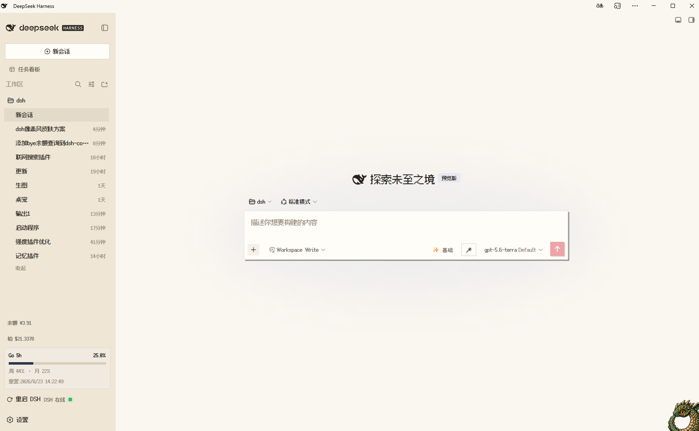
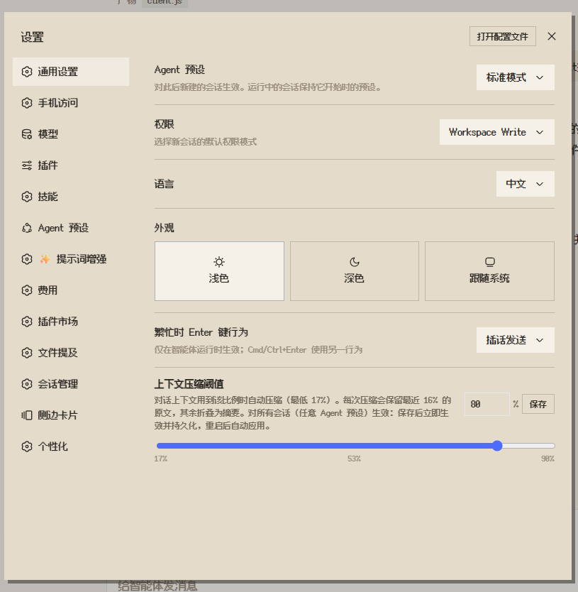

# dsh-pixel-skin · Red-White Pixel Skin

[中文文档](README.zh.md)

A Famicom-inspired pixel skin for the DeepSeek Harness Web GUI: warm white surfaces, cartridge red, charcoal text, square geometry, hard shadows, pixel fonts, grid texture, and stepped motion.

> 中文用户请阅读：[README.zh.md](README.zh.md)

给 DeepSeek Harness Web 换上 Famicom（红白机）配色的像素风皮肤：米白机壳 + 卡带红 + 炭黑，直角、硬阴影、像素字体、网格底、阶跃动画。

## 特性

- 只覆盖官方语义 token（`--dsw-alias-*` / `--dsw-specific-*`），不碰布局与组件
- 浅色 / 深色两套完整配色
- 中文与英文 UI：Fusion Pixel 12px Proportional SC（OFL-1.1）；代码/终端：Fusion Pixel 12px Monospaced SC
- 正文基准约 16px，代码与数字约 17px，避免像素字体显得过小
- 固定版本字体资源失败时回退到系统中文字体，不影响界面功能
- 直角、硬阴影、像素按下位移、方形滚动条、棋盘网格底
- 可选 CRT 扫描线（默认关）
- 与官方 Appearance（浅/深/跟随系统）兼容；与其他主题插件共存时**后加载层胜**（本插件默认最后加载 → 优先）

## Screenshots

### DSH Web home



### Settings



## 安装

### DSH Web 安装（推荐）

只需执行下面一条命令。`dsh plugin` 会在 `web` profile 中安装、登记并激活这个插件：

```sh
dsh plugin --profile web add dsh-pixel-skin
```

安装后重启 `dsh web` 并硬刷新浏览器。

### 作为普通 npm 依赖使用（可选）

如果你要在其他 Node.js 项目中引用这个包，可以使用：

```sh
npm install dsh-pixel-skin
# 或
pnpm add dsh-pixel-skin
```

这一步不会自动把插件加入 DSH Web profile；DSH 用户不需要先执行它。

查看当前 npm 版本：

```sh
npm view dsh-pixel-skin version
```

### GitHub 安装（当前可用）

```sh
dsh plugin --profile web add github:zhuifengqug/pixel-skin
```

### 本地安装

```sh
dsh plugin --profile web add D:/dsh/pixel-skin
```

重启 `dsh web` 并硬刷新浏览器。之后改 `lib/client.js` 只需硬刷新即可生效。

## 开关 / 控制台 API

浏览器控制台：

```js
__PIXELSKIN__.scanlines(true)   // 开启扫描线（false 关闭）
__PIXELSKIN__.off()             // 停用皮肤（刷新后恢复官方外观）
__PIXELSKIN__.on()              // 重新启用
```

localStorage：

- `pixel-skin:enabled` = `0` → 整体停用
- `pixel-skin:scanlines` = `1` → 扫描线

## 打包下载

不发布 npm 时，也可以生成本地 tarball：

```sh
npm pack
# 生成 dsh-pixel-skin-0.1.0.tgz

dsh plugin --profile web add ./dsh-pixel-skin-0.1.0.tgz
```

GitHub 仓库地址：<https://github.com/zhuifengqug/pixel-skin>

## 卸载

```sh
dsh plugin --profile web remove dsh-pixel-skin
```

## 已知边界

- 侧栏/工具栏图标是 @iconify 矢量图标，本皮肤只改颜色、不改图标形状
- Fusion Pixel 字体来自固定版本的字体资源；插件同时保留 `assets/fonts` 与 OFL-1.1 声明
- 当前 client bundle 使用固定 commit 的远程字体 URL；加载失败会回退系统字体。`assets/fonts` 保留完整字体文件，便于后续构建离线 data URI 版
- DSH 仍在 developer preview，token 集若变动需在 `lib/client.js` 的 `TOKENS` 里重新对齐
