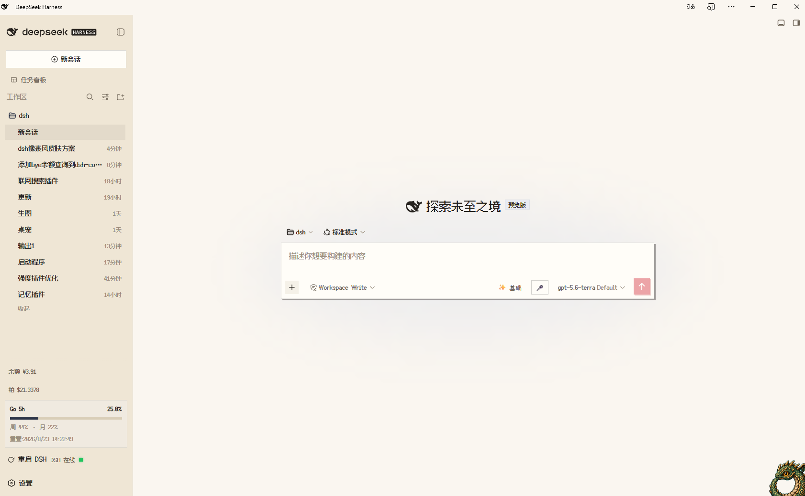
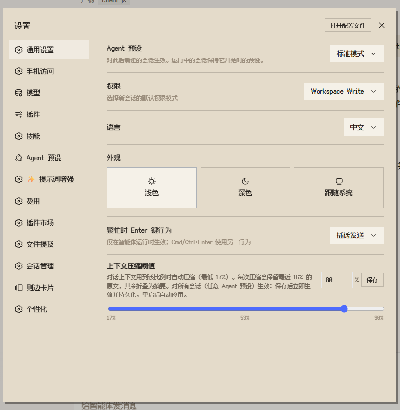

# dsh-pixel-skin · 红白机像素风皮肤

[English README](README.md)

给 DeepSeek Harness 换上红白机（Famicom）风格：米白机壳、卡带红、炭黑文字、墨蓝代码区、复古黄色交互态和掌机绿色成功态。Web（浏览器）与桌面端（Electron）均已适配。

## 特性

- 通过官方 ThemeService 覆盖浅色/深色语义 token，不修改 DSH 主仓库
- 中文与英文 UI 使用 Fusion Pixel 12px Proportional SC
- 代码与终端使用 Fusion Pixel 12px Monospaced SC
- 正文基准约 16px，代码与数字约 17px
- 直角、硬阴影、像素按下位移、方形滚动条和网格背景
- 墨蓝色代码/终端区域，黄色进行中和提示状态，绿色成功状态
- 可选 CRT 扫描线，默认关闭
- 与官方浅色、深色、跟随系统模式兼容
- 与其他主题插件共存时，本插件作为最后加载层优先覆盖冲突 token
- **四套可切换强调色**：红 / 蓝 / 绿 / 黄，在「设置 → 像素皮肤」分区一键切换，localStorage 持久化
- **HP 条式状态**：上下文分解条改为方形血量段（系统绿 / 工具蓝 / 消息随主题色），运行中的工具卡片显示「战斗中」斜纹扫动
- **GBA 式对话窗**：弹窗 / 菜单 / 面板使用双层像素描边，选中项黄色高亮
- **像素球加载动画**：圆形 spinner 替换为原创 8-bit 红白像素球（弹跳阶跃动画）
- **回合状态句**：思考中的「Deep diving...」可独立替换为 待机… / 正在蓄力… / 正在出招… / 正在进化…（「像素皮肤」设置分区或控制台切换）
- **桌面端适配（2.1.0 新增，2.1.1 修订）**：
  - Windows 自绘标题栏（Electron `html[data-windows-titlebar]`）：拖拽带铺米色侧栏底 + 2px 墨线，内容区 16px 圆角归零为像素直角；桌面 preload 注入的顶栏自动继承像素字体
  - 对 DSH 0.1.7 仅暴露 14 个主题 token 的现实对齐：所有旧 token 引用均带真实 token / 字面量兜底，桌面端不再出现「变透明 / 无边框」样式落空
  - 字体改为三级候选链：插件资源位 → 文档相对路径 → 固定 commit 远程兜底，加载失败自动降级
  - 2.1.1 修复三处桌面端过宽匹配：GBA 窗框不再命中主内容面板 / 顶栏菜单（改为 WAI-ARIA 浮层角色 + `_popup` 后缀，消除对话页 L 形黑线与横向滚动条）；侧栏行不再强制 padding（消除「技能中心 → 插件」行图标与文字重叠）；`_primary` 仅作用于按钮（防止任意元素被整体涂色）
  - 2.1.2：回合状态句匹配放宽——桌面端实际文本「深度求索中，用时1小时07分21秒」等带后缀变体也能替换，且保留用时后缀；像素球重绘为直角分层球（上红下白 + 墨带 + 白纽 + 墨线描边），替代 conic 渐变小尺寸下的红白噪点
  - 2.1.3：状态句替换改为文本节点级（不再整元素 textContent 改写——那会清空 React 子节点被立即重建，表现为替换不生效）；候选选择器扩展到 `_turnStatus` / `_activity` / `_busy`；`__PIXELSKIN__.status()` 热切换改为节点级短语替换并新增 `version` 字段便于核对已加载的 bundle 版本
  - 2.1.5：移除能力等级面板（自绘滑块）、滑块配色设置与 `/pixel-declare` 补全命令——受控滑块拖动时高频异步写入模型选择，与远端回写相互竞争，导致切换卡顿、需多次点击；推理等级切换回归官方模型菜单（模型档位由 cordis.patch.yml 对 llm-pi-ai providers 静态声明）

> 像素球、HP 条与窗框均为原创 8-bit 图形，灵感来自 90 年代掌机游戏界面；未使用任天堂 / Pokémon 官方素材或商标名称。

## 截图

### DSH Web 主页



### 设置页面



## 安装

### DSH 安装（推荐）

只需要执行下面这一条命令。`dsh plugin` 会在对应 profile 中完成包安装、登记和激活：

```sh
dsh plugin --profile web add dsh-pixel-skin
# 桌面端：
dsh plugin --profile desktop add dsh-pixel-skin
```

桌面端安装后重启 DeepSeek Harness 桌面应用即可；Web 安装后重启 `dsh web`，然后在浏览器中硬刷新（Ctrl+F5）。

### 作为普通 npm 依赖使用（可选）

如果你想在其他 Node.js 项目中使用这个包，可以执行：

```sh
npm install dsh-pixel-skin
# 或
pnpm add dsh-pixel-skin
```

这一步不会自动把插件加入 DSH Web profile；DSH 用户不需要先执行它。

查看当前 npm 版本：

```sh
npm view dsh-pixel-skin version
```

### GitHub 安装（当前可用）

```sh
dsh plugin --profile web add github:zhuifengqug/pixel-skin
```

### 本地安装

```sh
dsh plugin --profile web add D:/dsh/pixel-skin
```

安装后重启 `dsh web`，然后在浏览器中执行硬刷新（Ctrl+F5）。之后改 `lib/client.js` 需要重新构建客户端 bundle；若 DSH checkout 正在运行 `pnpm run dev:web`，客户端 HMR 可在重载后生效。

## 打包下载

如果不使用 npm，也可以在仓库目录生成 tarball：

```sh
npm pack
# 生成 dsh-pixel-skin-2.1.2.tgz

dsh plugin --profile web add ./dsh-pixel-skin-2.1.2.tgz
```

仓库地址：<https://github.com/zhuifengqug/pixel-skin>

## 控制台 API

在浏览器控制台执行：

```js
__PIXELSKIN__.palette('red') // 切换主题色：red / blue / green / yellow
__PIXELSKIN__.palettes() // ['red','blue','green','yellow']
__PIXELSKIN__.status('idle') // 状态句：idle / charge / move / evolve
__PIXELSKIN__.statuses() // ['idle','charge','move','evolve']
__PIXELSKIN__.scanlines(true) // 开启扫描线
__PIXELSKIN__.scanlines(false) // 关闭扫描线
__PIXELSKIN__.off() // 停用皮肤，刷新后恢复官方外观
__PIXELSKIN__.on() // 重新启用皮肤，刷新后生效
```

也可以通过 localStorage 控制：

```text
pixel-skin:enabled = 0     # 整体停用
pixel-skin:scanlines = 1   # 开启扫描线
```

## 卸载

```sh
dsh plugin --profile web remove dsh-pixel-skin
```

卸载后重启 `dsh web`（桌面端重启应用）并刷新页面即可恢复官方外观。

## 字体与许可证

插件使用 Fusion Pixel 字体：

- `Fusion Pixel 12px Proportional SC`：中文/英文 UI
- `Fusion Pixel 12px Monospaced SC`：代码和终端
- `Fusion Pixel Latin`：拉丁字符补充

字体版权归 TakWolf 所有，字体部分使用 SIL Open Font License 1.1。完整许可证见 [`assets/fonts/LICENSE.fusion-pixel.txt`](assets/fonts/LICENSE.fusion-pixel.txt)，第三方声明见 [`THIRD_PARTY_NOTICES.md`](THIRD_PARTY_NOTICES.md)。

## 已知边界

- 侧栏和工具栏图标是矢量图标，本皮肤主要调整颜色和表面，不重绘图标形状
- 字体使用三级候选链（`/plugins/dsh-pixel-skin/assets/fonts/*` → `./assets/fonts/*` → 固定 commit 远程 URL）；当前 DSH 的 `/plugins` 路由不服务插件 assets，本地两级候选多数情况下 404，由远程兜底加载；`assets/fonts` 保留作为离线构建来源
- 网络字体加载失败时会回退到系统中文字体，不影响 DSH 功能
- 桌面端 Windows 自绘标题栏样式基于 DSH 0.1.7-rc.2 的 `html[data-windows-titlebar]` 与 `.ZTP-Xa_*` 内部类名，官方调整骨架类名或变量名时需要同步更新
- GBA 窗框按 WAI-ARIA 浮层角色（dialog / menu / listbox / alertdialog / tooltip）与 `_popup` / `_popover` / `_dropdown` 类名后缀匹配；不使用这些角色/后缀的第三方插件浮层保持原生外观
- DSH 仍处于 developer preview，官方 token 名称变化时需要更新 `lib/client.js` 中的 `TOKENS`
